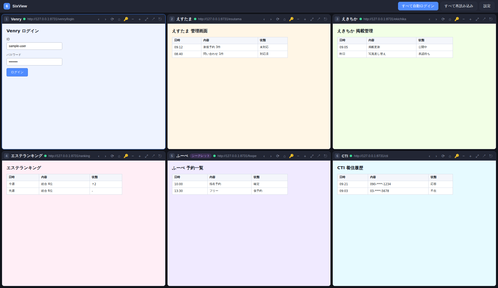
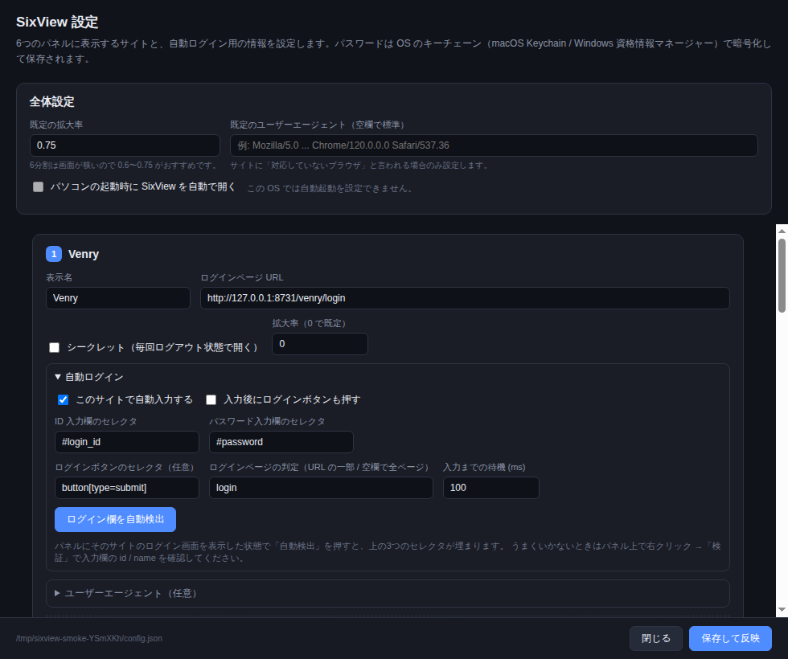

# SixView — 6サイトを1画面（上下3:3）で開くデスクトップアプリ

業務でよく使う6つのサイト（Venry / えすたま / えきちか / エステランキング / ふーぺ / CTI など）を、
**アプリを1つ開くだけ**で 3列 × 2段 の6画面に一気に表示するツールです。
Windows と macOS の両方で同じように動きます。



- パネルごとに**ログイン状態（Cookie）が独立**しているので、6サイトに同時ログインしても混ざりません
- ID / パスワードを登録しておけば、**ログイン画面で自動入力**（任意で自動送信まで）
- パスワードは **OS のキーチェーン**（macOS: Keychain / Windows: 資格情報マネージャー）で暗号化して保存
- パネル単位で「シークレット（毎回ログアウト状態）」にもできます
- パソコンの起動時に自動で開く設定つき

---

## 1. インストール手順

このアプリはまだ「ソースコードの状態」なので、**最初の1回だけ** 自分のパソコンでインストーラーを作ります。
2回目以降は普通のアプリと同じで、アイコンをダブルクリックするだけです。所要時間は10〜15分ほどです。

### 手順1: Node.js を入れる（初回のみ）

[https://nodejs.org](https://nodejs.org) を開き、**LTS** と書かれている方をダウンロードしてインストールします。
すでに入っている場合は飛ばして構いません。

### 手順2: このアプリのファイルを取ってくる

GitHub の [`claude/dazzling-mayer-stwiza` ブランチ](https://github.com/yuna-metisbel/everything-claude-code/tree/claude/dazzling-mayer-stwiza)
を開き、緑色の **Code** ボタン → **Download ZIP** を選びます。
ダウンロードした ZIP を展開し、分かりやすい場所（デスクトップなど）に置いてください。

### 手順3: インストーラーを作る

**Mac の場合** — 「ターミナル」を開いて、次を1行ずつ実行します。
`cd` と半角スペースを打ったあと、展開したフォルダの中の `tools/six-view` を
Finder からターミナルの窓にドラッグ＆ドロップすると、パスが自動で入ります。

```bash
cd <ここに tools/six-view をドラッグ＆ドロップ>
npm install
npm run dist:mac
```

**Windows の場合** — パスを調べる手間を省くため、エクスプローラーから PowerShell を開きます。

1. エクスプローラーで、展開したフォルダの中の `tools` → `six-view` フォルダを開く
2. 上のアドレスバー（パスが出ている帯）をクリックして、`powershell` と打って Enter

これで、そのフォルダにいる状態の PowerShell が開くので `cd` は不要です。あとは次を1行ずつ実行します。

```powershell
npm install
npm run dist:win
```

パスを直接打ちたい場合は、たいてい次の形になります（`ユーザー名` はご自身のもの）。

```text
C:\Users\ユーザー名\Downloads\everything-claude-code-claude-dazzling-mayer-stwiza\tools\six-view
```

ZIP を「すべて展開」すると、**同じ名前のフォルダが二重**になっていることがあります
（`everything-claude-code-...\everything-claude-code-...\tools\six-view`）。
その場合は奥の方が正しいパスです。フォルダを開いて `tools` が見える階層が目印です。

`npm install` は数分かかります。終わったら `tools/six-view/dist` フォルダが出来ています。

### 手順4: インストールする

`dist` フォルダの中身をダブルクリックします。

| OS | ファイル | やること |
|----|----------|----------|
| Mac | `SixView-1.0.0-arm64.dmg`（Intel Mac は `-x64`） | 開いて SixView を Applications フォルダにドラッグ |
| Windows | `SixView Setup 1.0.0.exe` | 実行してインストール（`SixView 1.0.0.exe` はインストール不要のポータブル版） |

**初回起動時の警告について** — 署名なしで作ったアプリなので、1回目だけ警告が出ます。

- Mac: アプリを右クリック →「開く」→ もう一度「開く」。
  それでも駄目なら **システム設定 → プライバシーとセキュリティ** の下の方に出る「このまま開く」を押します。
- Windows: 「WindowsによってPCが保護されました」と出たら **詳細情報 → 実行**。

これ以降は、Launchpad（Mac）やスタートメニュー（Windows）から普通に開けます。
設定画面の「パソコンの起動時に SixView を自動で開く」をオンにしておくと、電源を入れるだけで6画面が出ます。

## 2. 作らずに試すだけなら

インストーラーを作らず、その場で動かして確認することもできます。

```bash
cd tools/six-view
npm install
npm start
```

## 3. 起動したら

6つのサイトの URL は最初から登録済みなので、起動すればそのまま6画面が開きます。

| # | パネル | URL |
|---|--------|-----|
| 1 | Venry | `https://mrvenrey.jp/` |
| 2 | えすたま | `https://estama.jp/admin/` |
| 3 | えきちか | `https://ranking-deli.jp/admin/login` |
| 4 | エステランキング | `https://www.esthe-ranking.jp/login/` |
| 5 | ふーぺ | `https://www.fuupe.jp/login` |
| 6 | CTI | `https://prime-office-board.onrender.com/` |

各サイトに1回ログインすれば、以降は Cookie が保持されるので次回からログイン済みで開きます。
ID / パスワードの自動入力まで使いたい場合は、次の設定画面から登録します。

## 4. 設定画面でできること

| 項目 | 説明 |
|------|------|
| 表示名 | パネル左上に出る名前 |
| ログインページ URL | パネルが最初に開くページ（`https://` から入力） |
| シークレット | オンにすると毎回ログアウト状態で開きます |
| 拡大率 | そのパネルだけの表示倍率。`0` で全体設定に従う |
| 自動ログイン | 下記を参照 |
| ユーザーエージェント | 「対応していないブラウザです」と言われる場合だけ設定 |
| ログイン ID / パスワード | 保存すると自動ログインに使われます |
| 起動時に自動で開く | パソコンを立ち上げると SixView が自動起動します |

### 自動ログインの設定手順

1. そのサイトの **ログイン画面をパネルに表示** しておく（ログアウト状態にする）
2. **設定** を開き、そのサイトの **自動ログイン** を開いて **「ログイン欄を自動検出」** を押す
   → ID 欄・パスワード欄・ログインボタンのセレクタが自動で入り、「自動入力する」もオンになります
3. **ログイン ID / パスワード** を入力して「認証情報を保存」
4. 「保存して反映」を押す



これで次回以降、そのサイトのログイン画面を開くと自動で入力されます。
送信ボタンまで押してほしい場合は「入力後にログインボタンも押す」をオンにしてください。

自動検出がうまくいかないサイトだけ、セレクタを手入力します。パネル上で右クリック →
「検証」（または メニューの **表示 → 開発者ツール**）で入力欄を選び、`id` や `name` を確認してください。
よくある例:

| サイトの作り | セレクタの書き方 |
|--------------|------------------|
| `<input id="login_id">` | `#login_id` |
| `<input name="account">` | `input[name="account"]` |
| パスワード欄全般 | `input[type="password"]` |
| ログインボタン | `button[type="submit"]` |

- **ログインページの判定**: URL に含まれる文字列（例 `login`）。空欄ならそのサイトの全ページで試します。
  `/regex/i` の形式で正規表現も書けます。
- **入力後にログインボタンも押す**: オンにすると送信まで自動で行います。
  まずはオフで「入力されるか」を確認してからオンにするのが安全です。
- **入力までの待機 (ms)**: 画面の描画が遅いサイトでは `1000` くらいに増やしてください。

### 自動ログインが効かないとき

| 症状 | 対処 |
|------|------|
| 何も入力されない | ログイン画面を表示した状態で「ログイン欄を自動検出」をやり直す。それでも駄目ならセレクタを手入力 |
| 「パネルがまだ読み込まれていません」と出る | そのパネルにページが表示されてから検出してください |
| 「パスワード欄が見つかりません」と出る | すでにログイン済みの可能性。`⎋` でログイン状態を消してから再検出 |
| 途中まで入力されて消える | 「入力までの待機」を長くする |
| 二要素認証がある | 自動送信をオフにして、コードだけ手入力してください |
| ログインが毎回切れる | そのパネルの「シークレット」がオンになっていないか確認 |

## 5. キーボードショートカット

| 操作 | Windows | macOS |
|------|---------|-------|
| パネル 1〜6 を選択 | `Ctrl` + `1`〜`6` | `⌘` + `1`〜`6` |
| 選択中のパネルを拡大 / 元に戻す | `Ctrl` + `Shift` + `M` | `⌘` + `Shift` + `M` |
| すべて再読み込み | `Ctrl` + `Shift` + `R` | `⌘` + `Shift` + `R` |
| すべて自動ログイン | `Ctrl` + `Shift` + `L` | `⌘` + `Shift` + `L` |
| 設定を開く | `Ctrl` + `,` | `⌘` + `,` |

パネル名をダブルクリックしても拡大 / 復帰できます。

## 6. パネルのボタン

| ボタン | 動作 |
|--------|------|
| `‹` `›` | 戻る / 進む |
| `⟳` | 再読み込み |
| `⌂` | 設定したトップページへ戻る |
| 鍵マーク | 自動ログインを今すぐ実行 |
| `−` `＋` | 表示を縮小 / 拡大 |
| `⤢` | このパネルだけ全画面表示 / 元に戻す |
| 右上向き矢印 | 今のページを既定のブラウザで開く |
| `⎋` | このパネルのログイン状態（Cookie）を消す＝ログアウト |

## 7. 設定ファイルの場所

設定画面の左下に表示されているパスに `config.json` と `credentials.json` があります。

| OS | 場所 |
|----|------|
| Windows | `%APPDATA%\SixView\` |
| macOS | `~/Library/Application Support/SixView/` |

- `config.json` … サイトの URL やセレクタ（パスワードは入っていません）
- `credentials.json` … OS のキーチェーンで暗号化された ID / パスワード

`sites.example.json` は初期状態と同じ内容です。設定を作り直したいときは、これを `config.json`
としてコピーしてからアプリを起動してください。
別の PC へ移すときは `config.json` だけをコピーしてください
（`credentials.json` はその PC でしか復号できないため、パスワードは移行先で入れ直します）。

## 8. セキュリティについて

- パスワードは平文でファイルに書き込みません。OS の暗号化領域（macOS Keychain / Windows DPAPI）を使います。
- キーチェーンが使えない環境では**保存を拒否**し、画面上部に警告を表示します。この場合は Cookie によるログイン保持のみ使えます。
- パスワードは常にメインプロセスからログイン画面へ直接入力され、画面側のコードには渡していません。
- 各パネルは Node.js 権限なしの状態で動作します（`nodeIntegration` 無効・`contextIsolation` 有効）。
- 共有 PC では「シークレット」を使うか、終了前に `⎋` でログイン状態を消してください。

## 9. 開発

```bash
npm start                      # 起動
npm run icon                   # assets/icon.png を作り直す
node ../../tests/tools/six-view.test.js   # ユニットテスト
```

ファイル構成:

```text
src/
  main.js              メインプロセス（ウィンドウ・パネル制御・自動ログイン実行）
  menu.js              アプリメニューとショートカット
  preload.js           画面とメインの受け渡し（パスワードは通しません）
  lib/
    config-schema.js   設定の既定値と正規化（Electron 非依存 = テスト可能）
    config-store.js    config.json の読み書き
    secret-store.js    キーチェーンを使った認証情報の保管
    autofill.js        ログイン自動入力スクリプトの生成
  renderer/
    index.html/.css/.js     6分割グリッド画面
    settings.html/.css/.js  設定画面
```
